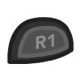

# Gyro Revolution for Half-Life 2
by Major Gnuisance
## Table of Contents
1.  [Introduction](#introduction)
2.  [Resource summary](#resources)
3.  [Installation, summarized](#installation)
4.  [Installation, detailed](#installation_detailed)
5.  [Removal](#uninstall)
6.  [Controls](#controls)
    1.  [Basics](#basic_controls)
    2.  [Weapons](#weapons)
    3.  [Utility](#utility)
    4.  [Menu mode](#menumode)
7.  [Feature List](#features)
8.  [Bugs/Problems](#bugs)
9.  [Possible Improvements](#improvements)
10. [Changelog](#changelog)
    1.  [v1.0-beta](#v1.0-beta)
    2.  [v1.1](#v1.1)
    3.  [v1.1.1](#v1.1.1)
11. [Acknowledgments](#acknowledgments)
12. [Contact](#contact)

# Introduction

This page will help you set up and use my Steam Input configuration
to play Half-Life 2 with a DualShock 4 controller.

Here's some footage of what playing with this looks like:

<iframe width="560" height="315" src="https://www.youtube-nocookie.com/embed/qoeJINASIuM" frameborder="0" allow="accelerometer; autoplay; encrypted-media; gyroscope; picture-in-picture" allowfullscreen></iframe>  

Follow either the summarized or detailed Installation section to set
everything up, then check out the Controls section details to see
how this control scheme works exactly.

# Resource summary

-   Custom cfg file: [gyro\_revolution.cfg](gyro_revolution.cfg)
-   Icon pack: [HL2\_TouchMenuIcons.zip](HL2_TouchMenuIcons.zip)
-   Controller Configuration
    -   v1.1 URLs:
        -   Half-Life 2: [steam://controllerconfig/220/2083662274](steam://controllerconfig/220/2083662274)
        -   Half-Life 2 Episode 1: [steam://controllerconfig/380/2083662274](steam://controllerconfig/380/2083662274)
        -   Half-Life 2 Episode 2: [steam://controllerconfig/420/2083662274](steam://controllerconfig/420/2083662274)
    -   VDF file for manual import: [gyro\_revolution\_hl2\_v1.1.vdf](gyro_revolution_hl2_v1.1.vdf)

# Installation, summarized

1.  Extract icon pack into game's directory (`Half-Life 2`)
2.  Put `gyro_revolution.cfg` under the `hl2/cfg/` directory
    1.  For Episodes 1 and 2, put it in the `episodic/cfg/` directory
3.  Add a line with `exec gyro_revolution` to your `autoexec.cfg` file in the same directory (`hl2/cfg/` or `episodic/cfg/`). You can use [this autoexec.cfg](autoexec.cfg) if you don't have one.
4.  Connect DS4 controller
5.  Enable PlayStation Configuration Support in Big Picture, if not already enabled
6.  Import my controller configuration (link above)
7.  (Linux only) Remove the file at `<GAME_DIRECTORY>/bin/libSDL2-2.0.so.0`

# Installation, detailed

1.  Install icon pack and custom configuration file
    1.  Open the game's directory
        -   Right click game in Steam library > Manage > Browse local files  
            
    2.  Extract the [Icon Pack zip](HL2_TouchMenuIcons.zip) there. You should now have a `TouchMenuIcons` directory.
    3.  Enter the `hl2/cfg/` directory and place the [gyro\_revolution.cfg](gyro_revolution.cfg) and [autoexec.cfg](autoexec.cfg) files there.
        -   For Episode 1 and Episode 2, use the `episodic/cfg/` directory instead.
        -   If you already have an `autoexec.cfg` file, you can edit it and add a line with following text: `exec gyro_revolution`
    4.  (OPTIONAL) Make a backup of your `config.cfg` file, should you want to restore it later.
2.  Connect your DualShock 4 to your computer. Either:
    -   Wired, using a micro USB cable
    -   Wireless, using Bluetooth
        -   With the DualShock 4 turned off, hold SHARE and the PS
            button to enter Bluetooth pairing mode, then pair it with the
            computer.
3.  Enable DualShock 4 configuration support in Steam's Big Picture mode
    1.  Start Big Picture by clicking the button to the left of the "minimize" button in Steam  
        
    2.  Go to Setting > Controller Settings  
         
    3.  Check "PlayStation Configuration Support" box  
        
    4.  Select your controller under "Detected Controllers" and then click **Calibrate**  
          
        
    5.  Tune your joystick deadzones if necessary  
        
    6.  Place the controller on a **stable, level surface** and click "Start Gyro-Only Calibration."  
        
    7.  Make sure the controller stays completely still until the calibration is done (about 5 seconds).
4.  Import my configuration
    1.  Click the links below to open the configuration in Steam. Choose the one for the game you want.
        -   [Half-Life 2](steam://controllerconfig/220/2083662274)
        -   [Half-Life 2: Episode 1](steam://controllerconfig/380/2083662274)
        -   [Half-Life 2: Episode 2](steam://controllerconfig/420/2083662274)
    2.  This screen should appear:  
        
    3.  Press  to apply, then  to exit
5.  (Linux only) Remove the `libSDL2-2.0.so.0` file in the game
    files, under the `bin/` directory. It's outdated as of this
    writing (2020-05-03) and it can cause double input problems. The
    version included in the Steam Runtime works fine and will be used
    automatically instead.
6.  Play the game!

# Removal

1.  Remove the `exec gyro_revolution` line from your `autoexec.cfg` file
2.  Delete `config.cfg` and optionally restore a backup of it.

# Controls

## Basics

Use  and the **gyroscope** to **move the camera.**

It's recommended to rely on the gyro to aim and  for
broader motions.

The gyro is always on by default, but you can toggle it on and off
by clicking . It's recommended to turn it off when
driving outside of combat.

**Hold**  to aim more precisely.  
Gyro is always enabled when doing this.

*Note: If the camera moves on its own you might be experiencing
gyro drift.*  
*Try recalibrating the gyroscope as explained in the detailed
installation instructions if this happens.*

Use  to **move**.  
Click  while moving to **sprint.**  
*You will stop sprinting when you return the stick to its neutral
position.*

**Tap**  to **jump.**  
**Tap**  to **toggle crouch.**  
**Press**  to **use.**  

**Hold**  to **crouch while jumping**, which may help extend your
reach, land tricky jumps or vault over obstacles.  
*Note: the game itself automatically crouch jumps in some
situations, usually next to boxes/windows/vents/etc.* *This is only
useful for more advanced moves.*

**Press**  to **pause.**

<table border="2" cellspacing="0" cellpadding="6" rules="groups" frame="hsides">
<caption class="t-above">Table 1: Summary</caption>

<colgroup>
<col  class="org-left" />

<col  class="org-left" />
</colgroup>
<thead>
<tr>
<th scope="col" class="org-left">Action</th>
<th scope="col" class="org-left">Control</th>
</tr>
</thead>

<tbody>
<tr>
<td class="org-left">Move</td>
<td class="org-left"></td>
</tr>

<tr>
<td class="org-left">Sprint</td>
<td class="org-left"> click</td>
</tr>

<tr>
<td class="org-left">Move Camera</td>
<td class="org-left">Gyro</td>
</tr>

<tr>
<td class="org-left">Move Camera (coarse)</td>
<td class="org-left"></td>
</tr>

<tr>
<td class="org-left">Toggle gyro</td>
<td class="org-left"> click</td>
</tr>

<tr>
<td class="org-left">Jump</td>
<td class="org-left"></td>
</tr>

<tr>
<td class="org-left">Crouch-jump</td>
<td class="org-left"> (hold)</td>
</tr>

<tr>
<td class="org-left">Toggle Crouch</td>
<td class="org-left"></td>
</tr>

<tr>
<td class="org-left">Use</td>
<td class="org-left"></td>
</tr>

<tr>
<td class="org-left">Pause</td>
<td class="org-left"></td>
</tr>
</tbody>
</table>

## Weapons

**Pull**  for primary fire and **press**  for secondary fire.  
**Tap**  to **reload**

**Tap**  to swap to your previously selected weapon.  
**Hold**  to bring up the **Weapon Select Wheel** and then select a weapon
with .

Due to usability constraints, not all weapons are in the selection
wheel, but they have their own dedicated quick access buttons.

The following weapons have quick access buttons:

-   **Crowbar** on 
-   **Grenades** on **Hold**  and **Hold** 
-   **Gravity Gun** on 
-   **Pheropods** on **Hold**  or icon in .

You can also browse and select from available weapons the
traditional way with  and . Press
 to confirm your selection.

<table border="2" cellspacing="0" cellpadding="6" rules="groups" frame="hsides">
<caption class="t-above">Table 2: Summary</caption>

<colgroup>
<col  class="org-left" />

<col  class="org-left" />
</colgroup>
<thead>
<tr>
<th scope="col" class="org-left">Action</th>
<th scope="col" class="org-left">Control</th>
</tr>
</thead>

<tbody>
<tr>
<td class="org-left">Fire</td>
<td class="org-left"></td>
</tr>

<tr>
<td class="org-left">Secondary fire</td>
<td class="org-left"></td>
</tr>

<tr>
<td class="org-left">Reload</td>
<td class="org-left"></td>
</tr>
</tbody>

<tbody>
<tr>
<td class="org-left">Weapon Wheel</td>
<td class="org-left">Hold  + </td>
</tr>

<tr>
<td class="org-left">Last Weapon</td>
<td class="org-left">Tap </td>
</tr>

<tr>
<td class="org-left">Previous/Next Slot</td>
<td class="org-left"> / </td>
</tr>
</tbody>

<tbody>
<tr>
<td class="org-left">Crowbar</td>
<td class="org-left"></td>
</tr>

<tr>
<td class="org-left">Gravity Gun (swap)</td>
<td class="org-left"></td>
</tr>

<tr>
<td class="org-left">Grenade</td>
<td class="org-left"> (hold),  (hold)</td>
</tr>

<tr>
<td class="org-left">Pheropods</td>
<td class="org-left"> (hold), </td>
</tr>
</tbody>
</table>

## Utility

Hold  to zoom in and reduce aiming sensitivity.  
Use it to aim with additional precision if necessary.  
This temporarily enables the gyroscope if it's toggled off.

**Hold**  to **toggle the flashlight**.

**Click**  to toggle the gyroscope.

**Squad Commands** can be found on the **right edge** of 

**Click and hold** the corresponding  icons to
**Quicksave** or **Quickload**.   
(The requirement to hold is so that you don't accidentally save or
load your game.)

<table border="2" cellspacing="0" cellpadding="6" rules="groups" frame="hsides">
<caption class="t-above">Table 3: Summary</caption>

<colgroup>
<col  class="org-left" />

<col  class="org-left" />
</colgroup>
<thead>
<tr>
<th scope="col" class="org-left">Action</th>
<th scope="col" class="org-left">Control</th>
</tr>
</thead>

<tbody>
<tr>
<td class="org-left">Aim mode</td>
<td class="org-left"></td>
</tr>

<tr>
<td class="org-left">Gyro Toggle</td>
<td class="org-left">Click </td>
</tr>

<tr>
<td class="org-left">Flashlight Toggle</td>
<td class="org-left">Hold </td>
</tr>

<tr>
<td class="org-left">Quickload/save</td>
<td class="org-left"></td>
</tr>

<tr>
<td class="org-left">Squad send/recall</td>
<td class="org-left"></td>
</tr>
</tbody>
</table>

## Menu mode

When the mouse cursor is shown, the configuration enters a special
mode for menu interaction.

In this mode, the following controls are available:

<table border="2" cellspacing="0" cellpadding="6" rules="groups" frame="hsides">

<colgroup>
<col  class="org-left" />

<col  class="org-left" />
</colgroup>
<thead>
<tr>
<th scope="col" class="org-left">Action</th>
<th scope="col" class="org-left">Control</th>
</tr>
</thead>

<tbody>
<tr>
<td class="org-left">Mouse</td>
<td class="org-left"> or </td>
</tr>

<tr>
<td class="org-left">Click</td>
<td class="org-left"> click,  click or </td>
</tr>

<tr>
<td class="org-left">Volume Up/Down</td>
<td class="org-left"> up/down</td>
</tr>
</tbody>
</table>

# Feature List

-   Weapon Selection Wheel ( + )
    -   Quickly select specific weapons
    -   Game slows down when the weapon wheel is held open
    -   Toggle to last weapon by tapping weapon wheel button
-   Aim button 
    -   Zooms in and lowers sensitivity for finer aiming
-   Modern sprint button  (click)
    -   Click once while moving to start sprinting, return stick to center
        position to stop sprinting.
-   Direct quick access to Crowbar and Gravity Gun  / 
-   Sequential weapon select ( / )
-   Gyroscope aim
    -   Always on by default
    -   Can be toggled by clicking 
    -   Always available when holding aim button ()
-   Quickload and Quicksave on 
-   Menu interaction mode
    -   Triggers automatically when the mouse pointer is displayed,
        returns to game mode when the mouse is hidden
    -    and  can be used to move the mouse,
         click and  click for Left Mouse
        Button
-   Squad Command and Pheropods on 
-   Custom Steam Input Icons for Half-Life 2's Weapons
    -   Derived from touched up game assets
-   Lowered rumble intensity
    -   Excessive rumble may interfere with gyro aim the and default is
        way over the top

# Bugs/Problems

-   Achievements are disabled due to enabling cheats
    -   A cheat-free variant is planned
-   Potential weapon/mechanic spoilers from on-screen menus and documentation
    -   Maybe remove some labels but keep icons?
-    click doesn't uncrouch automatically.
    -   Need to find how to go directly into uncrouched state after a
        `toggle_duck`. `-duck` doesn't touch the toggled state, so it
        doesn't cut it.

# Possible Improvements

-   Enhance icon visibility in weapon wheel
-   Blur the background or something when the weapon wheel slowdown is enabled.
    -   `mat_hsv 1` makes it black and white and could be used for a
        similar effect, but feels like a bad hack
-   Add animation to zoom and slow motion.
    -   Idea: make a dynamic re-aliasing-based binding that
        increments/decrements stuff progressively upon repeated presses
        and couple it with a turbo activator. Could be brittle, though.
        -   Tried and failed. The turbo doesn't go fast enough to be smooth.
-   Full gyro off mode (if anyone asks for it)
-   Fine tune sensitivities and timings
-   Find way to hide spoilers until needed
    -   No way to save state after changing to/from menu mode, though&#x2026;
    -   Proper Steam Input integration or gameside weapon wheel
        implementation would be best, but it'd require a mod or an
        update from Valve
        -   Maybe Half-Life 2: Update would accept to include such a
            feature?
-   Some features require cheats => find alternatives or make those
    easily optional. An alternate no-cheat cfg file could be easy.
    -   Made it tunable in Section 5 of \`gyro\_revolution.cfg\`
-   Sounds aren't distorted when setting host\_timescale for the
    slowdown effect. See if there's any way to do this.
-   Add support for HL2: Update and MMOD
-   Fully test with Episode 1 & 2
-   Port to Steam Controller
-   Port to Half-Life 1, Half-Life 1: Source and other similar Source
    games.
    -   Let me know if you have any requests!

# Changelog

## v1.0-beta

-   Initial public release

## v1.1

-   Tweak trigger sensitivities
-   Rearrange touchpad menus
-   Fix Windows compatibility
    -   Fix sprint not resetting because Windows HL2 doesn't respond to
        KP\_SLASH binding with some keyboard layouts
    -   Fix OPTIONS not being bound (which was workaround for double
        input on Linux caused by the outdated SDL shipped with game)
-   Add fast forward button
-   Make tuning some parameters in \`gyro\_revolutio.cfg\` easier
-   Add versioning information to \`gyro\_revolution.cfg\`
-   Add warning about SDL on Linux

## v1.1.1

This version only affected the cfg file and guide.

-   Immediately apply changes made to sensitivity and FoV tunables
    upon (re)loading `gyro_revolution.cfg`
-   Fix outdated configuration link in the detailed installation. It
    was still pointing to v1.0 by mistake.
    -   Thank you to Mister Man for making me aware of the problem in
        the [YouTube comments of one of my videos!](https://www.youtube.com/watch?v=ToF2aQaXvGk&lc=UgziOKD3uJfIOTVA16F4AaABAg)
-   Add instructions on using this configuration with the Half-Life 2 Episodes
    -   This hasn't been thoroughly tested as of this writing. It's a
        direct reuse of the work done for Half-Life 2. The only changes
        were the controller configuration URLs and the location of the
        `cfg` directory.
-   Add contact information.

# Acknowledgments

-   The awesome guys at [THOSE AWESOME GUYS](https://thoseawesomeguys.com/) for their [free controller
    glyph pack](https://opengameart.org/content/free-keyboard-and-controllers-prompts-pack)
-   The [r/SteamController](https://www.reddit.com/r/SteamController/) community
-   Testing/debugging
    -   [Mister Man](https://www.youtube.com/channel/UCIQuALUrT-vH919klEze_vQ)

# Contact

You can find me at the following places (sorted by reliability):

-   [YouTube channel](https://www.youtube.com/channel/UCS-CFXJoATrKHrHciwJaX9A)
-   Email
    -   Click "view email address" on [the YouTube about page](https://www.youtube.com/channel/UCS-CFXJoATrKHrHciwJaX9A/about)
-   [GitHub](https://github.com/major-gnuisance)
-   [Reddit](https://www.reddit.com/u/majorgnuisance)
-   Discord: Major Gnuisance#7251
-   Twitter: [@MajorGnuisance](https://twitter.com/MajorGnuisance)

