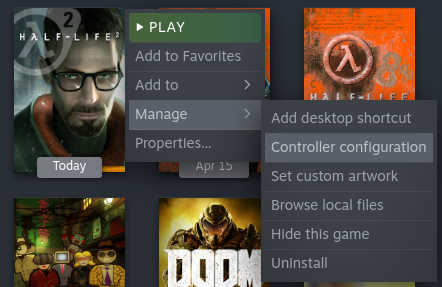

# Table of Contents

1.  [Introduction](#org402fee0)
2.  [Resource summary](#org19610dc)
3.  [Installation, summarized](#org588a592)
4.  [Installation, detailed](#org38845d3)
5.  [Uninstallation](#orgaab7a07)
6.  [Control overview](#org5667675)
    1.  [Basics](#org9121d4c)
        1.  [Summary](#orge806edc)
    2.  [Weapons](#org1b1af4e)
        1.  [Summary](#org0ef4ddc)
    3.  [Utility](#orgcebf0a2)
        1.  [Summary](#org45302ba)
7.  [Feature List](#org0eb4e0b)
8.  [Experimental features](#orgd080e00)
9.  [Bugs/Problems](#org9cca0a1)
10. [Possible Improvements](#org9d4db82)

# Introduction

This page will help you set up and use a modern control scheme for
Half-Life 2 with a DualShock 4 controller, via Steam Input.

The Installation section will show you how to set everything up.
The Controls section will teach you how to use this control scheme.

# Resource summary

-   Custom cfg file: [`gyro_revolution.cfg`](gyro_revolution.cfg)
-   Icon pack: [`HL2_TouchMenuIcons.zip`](HL2_TouchMenuIcons.zip)
-   Controller Configuration
    -   v1.0-beta URL: `steam://controllerconfig/220/2073106958`
    -   VDF file for manual import: [`gyro_revolution_hl2_v1.0-beta.vdf`](gyro_revolution_hl2_v1.0-beta.vdf)
-   Changelog: TODO

# Installation, summarized

1.  Extract icon pack into game's directory (`Half-Life 2`)
2.  Put `gyro_revolution.cfg` under the `hl2/cfg/` directory
3.  Add line with "`exec gyro_revolution`" to your `autoexec.cfg` file in the same directory (`hl2/cfg`). Create if necessary.
4.  Connect DS4 controller
5.  Enable PlayStation Configuration Support in Big Picture, if not already enabled
6.  Import my configuration

# Installation, detailed

1.  Install icon pack and custom configuration file
    1.  Open the game's directory
        -   Right click game in Steam library > Manage > Browse local files  
            
    2.  Extract the [Icon Pack zip](HL2_TouchMenuIcons.zip) there. You should now have a `TouchMenuIcons` directory.
    3.  Enter the hl2/cfg/ directory and place the [gyrorevolution.cfg](gyro_revolution.cfg) file there.
    4.  Add `exec gyro_revolution` to your `autoexec.cfg` file
        -   If you don't have an `autoexec.cfg` file, use this one: **TODO**
2.  Connect your DualShock 4 to your computer. Either:
    -   Wired using a micro USB cable
        -   Plug & Play
    -   Wireless using Bluetooth
        -   With the DualShock 4 turned off, hold OPTIONS and the PS
            button to enter Bluetooth pairing mode, then pair it with the
            computer.
3.  Enable DualShock 4 configuration support in Steam's Big Picture mode
    1.  Start Big Picture by clicking the button to the left of the "minimize" button in Steam  
        
    2.  Go to Setting > Controller Settings  
         
    3.  Check "PlayStation Configuration Support" box  
        
    4.  Select your controller under "Detected Controllers" and then click **Calibrate**  
          
        
    5.  Tune your joystick deadzones if necessary  
        
    6.  Place the controller on a **stable, level surface** and click "Start Gyro-Only Calibration."  
        
    7.  Make sure the controller stays completely still until the calibration is done (about 5 seconds).
4.  Import my configuration
    -   Using the steam:// URL
        1.  Copy this url: steam://controllerconfig/220/2073106958
        2.  Right click game in Steam library > Manage > Controller Configuration 
5.  Play the game!

# Uninstallation

1.  Remove the `exec gyro_revolution` line from your `autoexec.cfg` file
2.  

# Control overview

## Basics

Use the **right stick** (RS) and the **gyroscope** (controller yaw/pitch
movement, also referred to as **gyro**) to **move the camera.**

It's recommended to **rely on the gyro to aim precisely**, relegating
the right stick for broader motions only, such as turning,
recentering and coarse target acquisition.

To readjust your controller stance without moving the camera, hold
the right stick click (R3). This will temporarily disable the gyro
input.

To toggle gyro always-on, press the **SHARE** button. Gyro aiming
will always be enabled when holding **L2** to aim.  
Pressing **R3** will reenable gyro always-on, allowing you to quickly
restore fine aiming in unexpected confrontations.

If the camera moves on its own, you need to **recalibrate the
gyroscope.**  
Setting the controller on a flat surface for a while may help, but
running the calibration procedure in Steam Big Picture Mode's
settings provides better, long-lasting results.

Use the **left stick** (LS) to **move**.
**Tap L3** (left stick click) to **sprint** until you release the stick.

**Tap X** to **jump.**
**Circle** to **use.**
**Tap Triangle** to **toggle crouch.**

**Hold X** to **crouch after a jump**, which may help extend your reach
and land tricky jumps. Note: the game itself automatically crouch
jumps in some situations, usually next to boxes/windows/vents/etc.

**Press OPTIONS** to **pause.**

### Summary

<table border="2" cellspacing="0" cellpadding="6" rules="groups" frame="hsides">

<colgroup>
<col  class="org-left" />

<col  class="org-left" />
</colgroup>
<thead>
<tr>
<th scope="col" class="org-left">Action</th>
<th scope="col" class="org-left">Control</th>
</tr>
</thead>

<tbody>
<tr>
<td class="org-left">Move</td>
<td class="org-left">LS - Left Stick</td>
</tr>

<tr>
<td class="org-left">Move Camera</td>
<td class="org-left">Gyro - Controller Motion</td>
</tr>

<tr>
<td class="org-left">Move Camera (coarse)</td>
<td class="org-left">RS - Right Stick</td>
</tr>

<tr>
<td class="org-left">Sprint</td>
<td class="org-left">L3 - Left Stick Click</td>
</tr>

<tr>
<td class="org-left">Jump</td>
<td class="org-left">X</td>
</tr>

<tr>
<td class="org-left">Crouch-jump</td>
<td class="org-left">X (hold)</td>
</tr>

<tr>
<td class="org-left">Toggle Crouch</td>
<td class="org-left">Triangle</td>
</tr>

<tr>
<td class="org-left">Pause</td>
<td class="org-left">OPTIONS</td>
</tr>
</tbody>
</table>

## Weapons

**Pull R2** for primary fire and **press R1** for secondary fire.
**Press Square** to **reload**

**Tap L1** to swap to your previously selected weapon.  
**Hold L1** to bring up the **Weapon Select Wheel** and select a weapon
**with the \*right stick**.

The **Weapon Select Wheel** is restricted to projectile weapons.

**Other Weapons** are placed differently:

-   **Crowbar** on **D-Pad UP**
-   **Grenades** on **Hold D-Pad UP**
-   **Gravity Gun** on **D-Pad DOWD**
-   **Pheropods** on **Hold D-Pad DOWN**
-   **RPG** on the **right edge of the touchpad**
-   **Squad Commands** on the **left edge of the touchpad**

You can also browse and select from available weapons the
traditional way with **D-Pad LEFT/RIGHT** and **R2** to confirm.

### Summary

<table border="2" cellspacing="0" cellpadding="6" rules="groups" frame="hsides">

<colgroup>
<col  class="org-left" />

<col  class="org-left" />
</colgroup>
<thead>
<tr>
<th scope="col" class="org-left">Action</th>
<th scope="col" class="org-left">Control</th>
</tr>
</thead>

<tbody>
<tr>
<td class="org-left">Fire</td>
<td class="org-left">R2</td>
</tr>

<tr>
<td class="org-left">Secondary fire</td>
<td class="org-left">R1</td>
</tr>

<tr>
<td class="org-left">Reload</td>
<td class="org-left">Square</td>
</tr>
</tbody>

<tbody>
<tr>
<td class="org-left">Weapon Wheel</td>
<td class="org-left">Hold L1 + RS</td>
</tr>

<tr>
<td class="org-left">Last Weapon</td>
<td class="org-left">Tap L1</td>
</tr>

<tr>
<td class="org-left">Previous/Next Slot</td>
<td class="org-left">D-Pad LEFT/RIGHT</td>
</tr>
</tbody>

<tbody>
<tr>
<td class="org-left">Crowbar</td>
<td class="org-left">D-Pad UP</td>
</tr>

<tr>
<td class="org-left">Gravity Gun (swap)</td>
<td class="org-left">D-Pad DOWN</td>
</tr>

<tr>
<td class="org-left">Grenade</td>
<td class="org-left">Hold D-Pad UP</td>
</tr>

<tr>
<td class="org-left">Pheropod</td>
<td class="org-left">Hold D-Pad DOWN</td>
</tr>

<tr>
<td class="org-left">RPG</td>
<td class="org-left">Touchpad, right edge</td>
</tr>

<tr>
<td class="org-left">Squad</td>
<td class="org-left">Touchpad, left edge</td>
</tr>
</tbody>
</table>

## Utility

Hold down **L2** (left trigger) to zoom in and reduce aiming
sensitivity. Use it to aim with additional precision.

**Hold Y** to **toggle the flashlight**.

**Click and hold** the corresponding touchpad icons to **Quicksave** or
**Quickload**.   
The requirement to hold is so that you don't accidentally save or
\*load your game.

**Hold R3** to temporarily disable the gyroscope, allowing you to
reposition the controller without whipping the camera around.

**Press SHARE** to toggle always-on gyro aiming.  
Gyro aiming will still be available when holding the Aim button (L2).  
**Press R3** to quickly reenable always-on gyro aiming.

### Summary

<table border="2" cellspacing="0" cellpadding="6" rules="groups" frame="hsides">

<colgroup>
<col  class="org-left" />

<col  class="org-left" />
</colgroup>
<thead>
<tr>
<th scope="col" class="org-left">Action</th>
<th scope="col" class="org-left">Control</th>
</tr>
</thead>

<tbody>
<tr>
<td class="org-left">Aim mode (ADS)</td>
<td class="org-left">L2</td>
</tr>

<tr>
<td class="org-left">Flashlight Toggle</td>
<td class="org-left">Hold Triangle</td>
</tr>

<tr>
<td class="org-left">Quickload/save</td>
<td class="org-left">Hold touchpad icons</td>
</tr>
</tbody>

<tbody>
<tr>
<td class="org-left">Gyro Stop</td>
<td class="org-left">Hold R3</td>
</tr>

<tr>
<td class="org-left">Gyro always-on toggle</td>
<td class="org-left">SHARE</td>
</tr>

<tr>
<td class="org-left">Enable Gyro always-on</td>
<td class="org-left">Tap R3</td>
</tr>
</tbody>
</table>

# Feature List

-   Weapon Selection Wheel (L1 + RS)
    -   Quickly select specific projectile weapons
    -   Optional game slowdown when selecting weapon (requires enabling cheats)
    -   Toggle to last weapon by tapping weapon wheel button
-   Quick access to special weapons with D-Pad UP/DOWN
-   (pseudo) Aim Down Sights button (L2)
    -   Zooms in and lowers sensitivity for finer aiming
    -   Higher magnification requires enabling cheats
    -   Doesn't really aim down sights. Get an actual mod for that
-   Modern sprint button (L3)
    -   Click once while moving to start sprinting, return stick to center
        position to stop sprinting.
-   Direct access to Crowbar and Gravity Gun (D-Pad UP/DOWN respectively)
-   Sequential weapon select (D-Pad LEFT/RIGHT)
-   Gyroscope aim
    -   Always on by default
    -   Can be temporarily stopped by holding R3
        -   e.g. hold R3 while readjusting your pose to avoid swinging the
            camera around
    -   Gyro can be turned on/off with OPTIONS button
        -   Still when holding ADS button (L2)
        -   Can be enabled again on a moment's notice by tapping R3
-   Quickload and Quicksave with safety (hold to trigger) on trackpad
-   Menu interaction mode
    -   Triggers automatically when the mouse pointer is displayed,
        returns to game mode when the mouse is hidden
    -   Trackpad and RS can be used to move the mouse, R3 and Touchpad
        click for Left Mouse Button
-   Squad Command and Pheropods on left edge of trackpad
-   Custom Steam Input Icons for Half-Life 2's Weapons
    -   Derived from game assets
-   Lowered rumble intensity (interferes with gyro aim and default is
    generally over the top)

# Experimental features

-   Vehicle controls (touchpad icon)
    -   Problems/limitations
        -   No way to trigger it automatically without native Steam Input
            support
        -   No apparent way to have analog accelerator/brake on triggers
            using Steam Input
        -   No apparent way to stop game from reading the raw right stick
            for camera control, so aiming with it is always weird
        -   No way to tutorialize an additional control scheme, so it's weird

# Bugs/Problems

-   Potential weapon/mechanic spoilers from on-screen menus and documentation
    -   Maybe remove some labels but keep icons?
    -   Especially Squad and Pheropod
-   [Linux, maybe others] Game still uses right stick as a source or relative camera
    input when driving vehicles, bypassing Steam Input
    -   Need to look into source code to figure out what's going on
-   [Linux, maybe others] Weapon Wheel can be finicky and only
    register inputs when "rolling" the stick, i.e. moving the stick
    straight into a weapon slot is ignored but moving it into an
    adjacent slot and then into the desired slot always works

# Possible Improvements

-   Enhance icon visibility in weapon wheel
-   Blur the background when the weapon wheel is on.
    -   `mat_hsv 1` makes it black and white and could be used for a
        similar effect
-   Full gyro off mode
-   Fine tune sensitivities and timings
-   Find way to hide spoilers until needed
    -   No way to save state after changing to/from menu mode, though&#x2026;
    -   Proper Steam Input integration or gameside weapon wheel
        implementation would be best, but require mod or update Valve
        -   Maybe Half-Life 2: Update would accept to have this?
-   Some features require cheats
    -   FoV requires
-   Proper zoom function currently not mapped at all
    -   Can't be used for ADS since it prevents firing weapons

