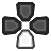

# Table of Contents

1.  [Introduction](#introduction)
2.  [Resource summary](#resources)
3.  [Installation, summarized](#installation)
4.  [Installation, detailed](#installation_detailed)
5.  [Removal](#uninstall)
6.  [Controls](#controls)
    1.  [Basics](#basic_controls)
    2.  [Weapons](#weapons)
    3.  [Utility](#utility)
7.  [Feature List](#features)
8.  [Bugs/Problems](#bugs)
9.  [Possible Improvements](#improvements)
10. [Acknowledgments](#acknowledgments)

# Introduction

This page will help you set up and use a modern control scheme for
Half-Life 2 with a DualShock 4 controller, via Steam Input.

The Installation section will show you how to set everything up.
The Controls section will teach you how to use this control scheme.

# Resource summary

-   Custom cfg file: [`gyro_revolution.cfg`](gyro_revolution.cfg)
-   Icon pack: [`HL2_TouchMenuIcons.zip`](HL2_TouchMenuIcons.zip)
-   Controller Configuration
    -   v1.0-beta URL: [`steam://controllerconfig/220/2073106958`](steam://controllerconfig/220/2073106958)
    -   VDF file for manual import: [`gyro_revolution_hl2_v1.0-beta.vdf`](gyro_revolution_hl2_v1.0-beta.vdf)
-   Changelog: **TODO**

# Installation, summarized

1.  Extract icon pack into game's directory (`Half-Life 2`)
2.  Put `gyro_revolution.cfg` under the `hl2/cfg/` directory
3.  Add line with "`exec gyro_revolution`" to your `autoexec.cfg` file in the same directory (`hl2/cfg`). Create if necessary.
4.  Connect DS4 controller
5.  Enable PlayStation Configuration Support in Big Picture, if not already enabled
6.  Import my configuration

# Installation, detailed

1.  Install icon pack and custom configuration file
    1.  Open the game's directory
        -   Right click game in Steam library > Manage > Browse local files  
            
    2.  Extract the [Icon Pack zip](HL2_TouchMenuIcons.zip) there. You should now have a `TouchMenuIcons` directory.
    3.  Enter the hl2/cfg/ directory and place the [`gyro_revolution.cfg`](gyro_revolution.cfg) file there.
    4.  (optional) make a backup of your `config.cfg` file should you want to restore it later.
    5.  Add `exec gyro_revolution` to your `autoexec.cfg` file
        -   If you don't have an `autoexec.cfg` file, use this one: **TODO**
2.  Connect your DualShock 4 to your computer. Either:
    -   Wired using a micro USB cable
    -   Wireless using Bluetooth
        -   With the DualShock 4 turned off, hold SHARE and the PS
            button to enter Bluetooth pairing mode, then pair it with the
            computer.
3.  Enable DualShock 4 configuration support in Steam's Big Picture mode
    1.  Start Big Picture by clicking the button to the left of the "minimize" button in Steam  
        
    2.  Go to Setting > Controller Settings  
         
    3.  Check "PlayStation Configuration Support" box  
        
    4.  Select your controller under "Detected Controllers" and then click **Calibrate**  
          
        
    5.  Tune your joystick deadzones if necessary  
        
    6.  Place the controller on a **stable, level surface** and click "Start Gyro-Only Calibration."  
        
    7.  Make sure the controller stays completely still until the calibration is done (about 5 seconds).
4.  Import my configuration
    1.  [Click here](steam://controllerconfig/220/2073106958) to open the configuration in Steam. It should open this screen:  
        
    2.  Press  to apply, then  to exit
5.  Play the game!

# Removal

1.  Remove the `exec gyro_revolution` line from your `autoexec.cfg` file
2.  Delete `config.cfg` and possibly restore a backup of it.

# Controls

## Basics

Use the **right stick** and the **gyroscope** to **move the camera.**

It's recommended to rely on the gyro to aim precisely and to use
the right stick for broader motions only, such as turning,
recentering and coarse target acquisition.

The gyro is always-on by default, but you can temporarily toggle it
off by clicking . This is recommended when driving.

**Hold**  to aim more precisely. Gyro is always enabled when doing this.

****Note:**** If the camera moves on its own you might be experiencing
****gyro drift.**** Try recalibrating the gyroscope as explained in the
detailed installation instructions.

Use  to **move**.  
Click **** while moving to **sprint.** You will
stop sprinting when you return the stick to its neutral position.

**Tap**  to **jump.**  
**Press**  to **use.**  
**Tap**  to **toggle crouch.**

**Hold**  to **crouch while jumping**, which may help extend your
reach, land tricky jumps or vault over obstacles.  
Note: the game itself automatically crouch jumps in some
situations, usually next to boxes/windows/vents/etc. This is only
useful for more advanced moves.

**Press OPTIONS** to **pause.**

<table border="2" cellspacing="0" cellpadding="6" rules="groups" frame="hsides">
<caption class="t-above">Table 1: Summary</caption>

<colgroup>
<col  class="org-left" />

<col  class="org-left" />
</colgroup>
<thead>
<tr>
<th scope="col" class="org-left">Action</th>
<th scope="col" class="org-left">Control</th>
</tr>
</thead>

<tbody>
<tr>
<td class="org-left">Move</td>
<td class="org-left"></td>
</tr>

<tr>
<td class="org-left">Move Camera</td>
<td class="org-left">Gyro</td>
</tr>

<tr>
<td class="org-left">Move Camera (coarse)</td>
<td class="org-left"></td>
</tr>

<tr>
<td class="org-left">Sprint</td>
<td class="org-left"> click</td>
</tr>

<tr>
<td class="org-left">Jump</td>
<td class="org-left"></td>
</tr>

<tr>
<td class="org-left">Crouch-jump</td>
<td class="org-left"> (hold)</td>
</tr>

<tr>
<td class="org-left">Toggle Crouch</td>
<td class="org-left"></td>
</tr>

<tr>
<td class="org-left">Pause</td>
<td class="org-left"></td>
</tr>
</tbody>
</table>

## Weapons

**Pull ** for primary fire and **press ** for secondary fire.
**Press ** to **reload**

**Tap ** to swap to your previously selected weapon.  
**Hold ** to bring up the **Weapon Select Wheel** and select a weapon
**with the \*right stick**.

The **Weapon Select Wheel** is restricted to projectile weapons.

**Other Weapons** are placed differently:

-   **Crowbar** on **D-Pad UP**
-   **Grenades** on **Hold D-Pad UP**
-   **Gravity Gun** on **D-Pad DOWD**
-   **Pheropods** on **Hold D-Pad DOWN**
-   **RPG** on the **right edge of the touchpad**
-   **Squad Commands** on the **left edge of the touchpad**

You can also browse and select from available weapons the
traditional way with **D-Pad LEFT/RIGHT** and **** to confirm.

<table border="2" cellspacing="0" cellpadding="6" rules="groups" frame="hsides">
<caption class="t-above">Table 2: Summary</caption>

<colgroup>
<col  class="org-left" />

<col  class="org-left" />
</colgroup>
<thead>
<tr>
<th scope="col" class="org-left">Action</th>
<th scope="col" class="org-left">Control</th>
</tr>
</thead>

<tbody>
<tr>
<td class="org-left">Fire</td>
<td class="org-left"></td>
</tr>

<tr>
<td class="org-left">Secondary fire</td>
<td class="org-left"></td>
</tr>

<tr>
<td class="org-left">Reload</td>
<td class="org-left"></td>
</tr>
</tbody>

<tbody>
<tr>
<td class="org-left">Weapon Wheel</td>
<td class="org-left">Hold  + </td>
</tr>

<tr>
<td class="org-left">Last Weapon</td>
<td class="org-left">Tap </td>
</tr>

<tr>
<td class="org-left">Previous/Next Slot</td>
<td class="org-left"> / </td>
</tr>
</tbody>

<tbody>
<tr>
<td class="org-left">Crowbar</td>
<td class="org-left"></td>
</tr>

<tr>
<td class="org-left">Gravity Gun (swap)</td>
<td class="org-left"></td>
</tr>

<tr>
<td class="org-left">Grenade</td>
<td class="org-left"></td>
</tr>

<tr>
<td class="org-left">Pheropods</td>
<td class="org-left"></td>
</tr>

<tr>
<td class="org-left">Squad</td>
<td class="org-left">&#xa0;</td>
</tr>
</tbody>
</table>

## Utility

Hold down  to zoom in and reduce aiming
sensitivity. Use it to aim with additional precision.

**Hold**  to **toggle the flashlight**.

**Click and hold** the corresponding touchpad icons to **Quicksave** or
**Quickload**.   
The requirement to hold is so that you don't accidentally save or
\*load your game.

**Hold**  to temporarily disable the gyroscope, allowing you to
reposition the controller without whipping the camera around.

**Press SHARE** to toggle always-on gyro aiming.  
Gyro aiming will still be available when holding the Aim button ().  
**Press**  to quickly re-enable always-on gyro aiming.

<table border="2" cellspacing="0" cellpadding="6" rules="groups" frame="hsides">
<caption class="t-above">Table 3: Summary</caption>

<colgroup>
<col  class="org-left" />

<col  class="org-left" />
</colgroup>
<thead>
<tr>
<th scope="col" class="org-left">Action</th>
<th scope="col" class="org-left">Control</th>
</tr>
</thead>

<tbody>
<tr>
<td class="org-left">Aim mode (ADS)</td>
<td class="org-left"></td>
</tr>

<tr>
<td class="org-left">Flashlight Toggle</td>
<td class="org-left">Hold </td>
</tr>

<tr>
<td class="org-left">Quickload/save</td>
<td class="org-left">Hold touchpad icons</td>
</tr>
</tbody>

<tbody>
<tr>
<td class="org-left">Gyro Stop</td>
<td class="org-left">Hold </td>
</tr>

<tr>
<td class="org-left">Gyro always-on toggle</td>
<td class="org-left"></td>
</tr>

<tr>
<td class="org-left">Enable Gyro always-on</td>
<td class="org-left">Tap </td>
</tr>
</tbody>
</table>

# Feature List

-   Weapon Selection Wheel ( + )
    -   Quickly select specific projectile weapons
    -   Optional game slowdown when selecting weapon (requires enabling cheats)
    -   Toggle to last weapon by tapping weapon wheel button
-   Quick access to special weapons with D-Pad UP/DOWN
-   (pseudo) Aim Down Sights button ()
    -   Zooms in and lowers sensitivity for finer aiming
    -   Higher magnification requires enabling cheats
    -   Doesn't really aim down sights. Get an actual mod for that
-   Modern sprint button ()
    -   Click once while moving to start sprinting, return stick to center
        position to stop sprinting.
-   Direct quick access to Crowbar and Gravity Gun ( / )
-   Sequential weapon select ( / )
-   Gyroscope aim
    -   Always on by default
    -   Can be temporarily stopped by holding 
        -   e.g. hold  while readjusting your pose to avoid swinging the
            camera around
    -   Gyro can be turned on/off with OPTIONS button
        -   Still when holding ADS button ()
        -   Can be enabled again on a moment's notice by tapping 
-   Quickload and Quicksave with safety (hold to trigger) on trackpad
-   Menu interaction mode
    -   Triggers automatically when the mouse pointer is displayed,
        returns to game mode when the mouse is hidden
    -    and  can be used to move the mouse,
         click and  click for Left Mouse
        Button
-   Squad Command and Pheropods on left edge of trackpad
-   Custom Steam Input Icons for Half-Life 2's Weapons
    -   Derived from game assets
-   Lowered rumble intensity (interferes with gyro aim and default is
    generally over the top)

# Bugs/Problems

-   Achievements are disabled due to enabling cheats
-   Potential weapon/mechanic spoilers from on-screen menus and documentation
    -   Maybe remove some labels but keep icons?
-    click doesn't uncrouch automatically.
    -   Need to find how directly go into uncrouched state after a
        `toggle_duck`. `-duck` doesn't touch the toggled state, so it
        doesn't cut it.

# Possible Improvements

-   Enhance icon visibility in weapon wheel
-   Blur the background or something when the weapon wheel slowdown is enabled.
    -   `mat_hsv 1` makes it black and white and could be used for a
        similar effect, but feels like a bad hack
-   Add animation to zoom and slow motion.
    -   Idea: make a dynamic re-aliasing-based binding that
        increments/decrements stuff progressively upon repeated presses
        and couple it with a turbo activator. Could be brittle, though.
-   Full gyro off mode (if anyone asks for it)
-   Fine tune sensitivities and timings
-   Find way to hide spoilers until needed
    -   No way to save state after changing to/from menu mode, though&#x2026;
    -   Proper Steam Input integration or gameside weapon wheel
        implementation would be best, but it'd require a mod or an
        update from Valve
        -   Maybe Half-Life 2: Update would accept to include such a
            feature?
-   Some features require cheats => find alternatives or make those
    easily optional. An alternate no-cheat cfg file could be easy.
-   Sounds aren't distorted when setting hosttimescale for the
    slowdown effect. See if there's any way to do this.

# Acknowledgments

-   The awesome guys at [THOSE AWESOME GUYS](https://thoseawesomeguys.com/) for their [free controller
    glyph pack](https://opengameart.org/content/free-keyboard-and-controllers-prompts-pack)

