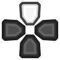

# Gyro Revolution for Half-Life 2
by Major Gnuisance
## Table of Contents
1.  [Introduction](#introduction)
2.  [Resource summary](#resources)
3.  [Installation, summarized](#installation)
4.  [Installation, detailed](#installation_detailed)
5.  [Removal](#uninstall)
6.  [Controls](#controls)
    1.  [Basics](#basic_controls)
    2.  [Weapons](#weapons)
    3.  [Utility](#utility)
    4.  [Menu mode](#menumode)
7.  [Feature List](#features)
8.  [Bugs/Problems](#bugs)
9.  [Possible Improvements](#improvements)
10. [Acknowledgments](#acknowledgments)

# Introduction

This page will help you set up and use my Steam Input configuration
to play Half-Life 2 with a DualShock 4 controller.

Here's some footage of what playing with this looks like:

<iframe width="560" height="315" src="https://www.youtube-nocookie.com/embed/qoeJINASIuM" frameborder="0" allow="accelerometer; autoplay; encrypted-media; gyroscope; picture-in-picture" allowfullscreen></iframe>  

Follow either the summarized or detailed Installation section to set
everything up, then check out the Controls section details to see
how this control scheme works exactly.

# Resource summary

-   Custom cfg file: [gyro\_revolution.cfg](gyro_revolution.cfg)
-   Icon pack: [HL2\_TouchMenuIcons.zip](HL2_TouchMenuIcons.zip)
-   Controller Configuration
    -   v1.0-beta URL: [steam://controllerconfig/220/2073106958](steam://controllerconfig/220/2073106958)
    -   VDF file for manual import: [gyro\_revolution\_hl2\_v1.0-beta.vdf](gyro_revolution_hl2_v1.0-beta.vdf)

# Installation, summarized

1.  Extract icon pack into game's directory (`Half-Life 2`)
2.  Put `gyro_revolution.cfg` under the `hl2/cfg/` directory
3.  Add line with "`exec gyro_revolution`" to your `autoexec.cfg` file in the same directory (`hl2/cfg`). Create if necessary.
4.  Connect DS4 controller
5.  Enable PlayStation Configuration Support in Big Picture, if not already enabled
6.  Import my configuration

# Installation, detailed

1.  Install icon pack and custom configuration file
    1.  Open the game's directory
        -   Right click game in Steam library > Manage > Browse local files  
            
    2.  Extract the [Icon Pack zip](HL2_TouchMenuIcons.zip) there. You should now have a `TouchMenuIcons` directory.
    3.  Enter the hl2/cfg/ directory and place the [gyro\_revolution.cfg](gyro_revolution.cfg) file there.
    4.  (optional) make a backup of your `config.cfg` file should you want to restore it later.
    5.  Add `exec gyro_revolution` to your `autoexec.cfg` file
        -   If you don't have an `autoexec.cfg` file, use this one: [autoexec.cfg](autoexec.cfg)
2.  Connect your DualShock 4 to your computer. Either:
    -   Wired using a micro USB cable
    -   Wireless using Bluetooth
        -   With the DualShock 4 turned off, hold SHARE and the PS
            button to enter Bluetooth pairing mode, then pair it with the
            computer.
3.  Enable DualShock 4 configuration support in Steam's Big Picture mode
    1.  Start Big Picture by clicking the button to the left of the "minimize" button in Steam  
        
    2.  Go to Setting > Controller Settings  
         
    3.  Check "PlayStation Configuration Support" box  
        
    4.  Select your controller under "Detected Controllers" and then click **Calibrate**  
          
        
    5.  Tune your joystick deadzones if necessary  
        
    6.  Place the controller on a **stable, level surface** and click "Start Gyro-Only Calibration."  
        
    7.  Make sure the controller stays completely still until the calibration is done (about 5 seconds).
4.  Import my configuration
    1.  [Click here](steam://controllerconfig/220/2073106958) to open the configuration in Steam. It should open this screen:  
        
    2.  Press  to apply, then  to exit
5.  Play the game!

# Removal

1.  Remove the `exec gyro_revolution` line from your `autoexec.cfg` file
2.  Delete `config.cfg` and possibly restore a backup of it.

# Controls

## Basics

Use  and the **gyroscope** to **move the camera.**

It's recommended to rely on the gyro to aim and  for
broader motions.

The gyro is always on by default, but you can toggle it on and off
by clicking . It's recommended to turn it off when
driving outside of combat.

**Hold**  to aim more precisely.  
Gyro is always enabled when doing this.

*Note: If the camera moves on its own you might be experiencing
gyro drift.*  
*Try recalibrating the gyroscope as explained in the detailed
installation instructions if this happens.*

Use  to **move**.  
Click  while moving to **sprint.**  
*You will stop sprinting when you return the stick to its neutral
position.*

**Tap**  to **jump.**  
**Tap**  to **toggle crouch.**  
**Press**  to **use.**  

**Hold**  to **crouch while jumping**, which may help extend your
reach, land tricky jumps or vault over obstacles.  
*Note: the game itself automatically crouch jumps in some
situations, usually next to boxes/windows/vents/etc.* *This is only
useful for more advanced moves.*

**Press**  to **pause.**

<table border="2" cellspacing="0" cellpadding="6" rules="groups" frame="hsides">
<caption class="t-above">Table 1: Summary</caption>

<colgroup>
<col  class="org-left" />

<col  class="org-left" />
</colgroup>
<thead>
<tr>
<th scope="col" class="org-left">Action</th>
<th scope="col" class="org-left">Control</th>
</tr>
</thead>

<tbody>
<tr>
<td class="org-left">Move</td>
<td class="org-left"></td>
</tr>

<tr>
<td class="org-left">Sprint</td>
<td class="org-left"> click</td>
</tr>

<tr>
<td class="org-left">Move Camera</td>
<td class="org-left">Gyro</td>
</tr>

<tr>
<td class="org-left">Move Camera (coarse)</td>
<td class="org-left"></td>
</tr>

<tr>
<td class="org-left">Toggle gyro</td>
<td class="org-left"> click</td>
</tr>

<tr>
<td class="org-left">Jump</td>
<td class="org-left"></td>
</tr>

<tr>
<td class="org-left">Crouch-jump</td>
<td class="org-left"> (hold)</td>
</tr>

<tr>
<td class="org-left">Toggle Crouch</td>
<td class="org-left"></td>
</tr>

<tr>
<td class="org-left">Use</td>
<td class="org-left"></td>
</tr>

<tr>
<td class="org-left">Pause</td>
<td class="org-left"></td>
</tr>
</tbody>
</table>

## Weapons

**Pull**  for primary fire and **press**  for secondary fire.  
**Tap**  to **reload**

**Tap**  to swap to your previously selected weapon.  
**Hold**  to bring up the **Weapon Select Wheel** and then select a weapon
with .

Due to usability constraints, not all weapons are in the selection
wheel, but they have their own dedicated quick access buttons.

The following weapons have quick access buttons:

-   **Crowbar** on 
-   **Grenades** on **Hold**  and **Hold** 
-   **Gravity Gun** on 
-   **Pheropods** on **Hold**  or icon in .

You can also browse and select from available weapons the
traditional way with  and . Press
 to confirm your selection.

<table border="2" cellspacing="0" cellpadding="6" rules="groups" frame="hsides">
<caption class="t-above">Table 2: Summary</caption>

<colgroup>
<col  class="org-left" />

<col  class="org-left" />
</colgroup>
<thead>
<tr>
<th scope="col" class="org-left">Action</th>
<th scope="col" class="org-left">Control</th>
</tr>
</thead>

<tbody>
<tr>
<td class="org-left">Fire</td>
<td class="org-left"></td>
</tr>

<tr>
<td class="org-left">Secondary fire</td>
<td class="org-left"></td>
</tr>

<tr>
<td class="org-left">Reload</td>
<td class="org-left"></td>
</tr>
</tbody>

<tbody>
<tr>
<td class="org-left">Weapon Wheel</td>
<td class="org-left">Hold  + </td>
</tr>

<tr>
<td class="org-left">Last Weapon</td>
<td class="org-left">Tap </td>
</tr>

<tr>
<td class="org-left">Previous/Next Slot</td>
<td class="org-left"> / </td>
</tr>
</tbody>

<tbody>
<tr>
<td class="org-left">Crowbar</td>
<td class="org-left"></td>
</tr>

<tr>
<td class="org-left">Gravity Gun (swap)</td>
<td class="org-left"></td>
</tr>

<tr>
<td class="org-left">Grenade</td>
<td class="org-left"> (hold),  (hold)</td>
</tr>

<tr>
<td class="org-left">Pheropods</td>
<td class="org-left"> (hold), </td>
</tr>
</tbody>
</table>

## Utility

Hold  to zoom in and reduce aiming sensitivity.  
Use it to aim with additional precision if necessary.  
This temporarily enables the gyroscope if it's toggled off.

**Hold**  to **toggle the flashlight**.

**Click**  to toggle the gyroscope.

**Squad Commands** can be found on the **right edge** of 

**Click and hold** the corresponding  icons to
**Quicksave** or **Quickload**.   
(The requirement to hold is so that you don't accidentally save or
load your game.)

<table border="2" cellspacing="0" cellpadding="6" rules="groups" frame="hsides">
<caption class="t-above">Table 3: Summary</caption>

<colgroup>
<col  class="org-left" />

<col  class="org-left" />
</colgroup>
<thead>
<tr>
<th scope="col" class="org-left">Action</th>
<th scope="col" class="org-left">Control</th>
</tr>
</thead>

<tbody>
<tr>
<td class="org-left">Aim mode</td>
<td class="org-left"></td>
</tr>

<tr>
<td class="org-left">Gyro Toggle</td>
<td class="org-left">Click </td>
</tr>

<tr>
<td class="org-left">Flashlight Toggle</td>
<td class="org-left">Hold </td>
</tr>

<tr>
<td class="org-left">Quickload/save</td>
<td class="org-left"></td>
</tr>

<tr>
<td class="org-left">Squad send/recall</td>
<td class="org-left"></td>
</tr>
</tbody>
</table>

## Menu mode

When the mouse cursor is shown, the configuration enters a special
mode for menu interaction.

In this mode, the following controls are available:

<table border="2" cellspacing="0" cellpadding="6" rules="groups" frame="hsides">

<colgroup>
<col  class="org-left" />

<col  class="org-left" />
</colgroup>
<thead>
<tr>
<th scope="col" class="org-left">Action</th>
<th scope="col" class="org-left">Control</th>
</tr>
</thead>

<tbody>
<tr>
<td class="org-left">Mouse</td>
<td class="org-left"> or </td>
</tr>

<tr>
<td class="org-left">Click</td>
<td class="org-left"> click,  click or </td>
</tr>

<tr>
<td class="org-left">Volume Up/Down</td>
<td class="org-left"> up/down</td>
</tr>
</tbody>
</table>

# Feature List

-   Weapon Selection Wheel ( + )
    -   Quickly select specific weapons
    -   Game slows down when the weapon wheel is held open
    -   Toggle to last weapon by tapping weapon wheel button
-   Aim button 
    -   Zooms in and lowers sensitivity for finer aiming
-   Modern sprint button  (click)
    -   Click once while moving to start sprinting, return stick to center
        position to stop sprinting.
-   Direct quick access to Crowbar and Gravity Gun  / 
-   Sequential weapon select ( / )
-   Gyroscope aim
    -   Always on by default
    -   Can be toggled by clicking 
    -   Always available when holding aim button ()
-   Quickload and Quicksave on 
-   Menu interaction mode
    -   Triggers automatically when the mouse pointer is displayed,
        returns to game mode when the mouse is hidden
    -    and  can be used to move the mouse,
         click and  click for Left Mouse
        Button
-   Squad Command and Pheropods on 
-   Custom Steam Input Icons for Half-Life 2's Weapons
    -   Derived from touched up game assets
-   Lowered rumble intensity
    -   Excessive rumble may interfere with gyro aim the and default is
        way over the top

# Bugs/Problems

-   Achievements are disabled due to enabling cheats
    -   A cheat-free variant is planned
-   Potential weapon/mechanic spoilers from on-screen menus and documentation
    -   Maybe remove some labels but keep icons?
-    click doesn't uncrouch automatically.
    -   Need to find how to go directly into uncrouched state after a
        `toggle_duck`. `-duck` doesn't touch the toggled state, so it
        doesn't cut it.

# Possible Improvements

-   Enhance icon visibility in weapon wheel
-   Blur the background or something when the weapon wheel slowdown is enabled.
    -   `mat_hsv 1` makes it black and white and could be used for a
        similar effect, but feels like a bad hack
-   Add animation to zoom and slow motion.
    -   Idea: make a dynamic re-aliasing-based binding that
        increments/decrements stuff progressively upon repeated presses
        and couple it with a turbo activator. Could be brittle, though.
-   Full gyro off mode (if anyone asks for it)
-   Fine tune sensitivities and timings
-   Find way to hide spoilers until needed
    -   No way to save state after changing to/from menu mode, though&#x2026;
    -   Proper Steam Input integration or gameside weapon wheel
        implementation would be best, but it'd require a mod or an
        update from Valve
        -   Maybe Half-Life 2: Update would accept to include such a
            feature?
-   Some features require cheats => find alternatives or make those
    easily optional. An alternate no-cheat cfg file could be easy.
-   Sounds aren't distorted when setting host\_timescale for the
    slowdown effect. See if there's any way to do this.
-   Add support for HL2: Update and MMOD

# Acknowledgments

-   The awesome guys at [THOSE AWESOME GUYS](https://thoseawesomeguys.com/) for their [free controller
    glyph pack](https://opengameart.org/content/free-keyboard-and-controllers-prompts-pack)
-   The [r/SteamController](https://www.reddit.com/r/SteamController/) community

